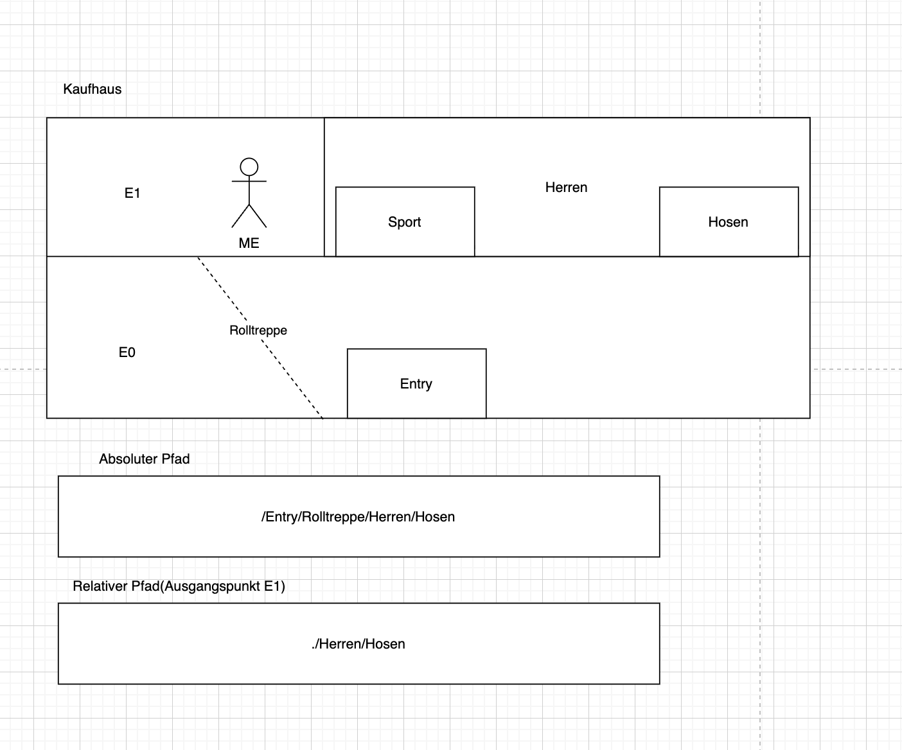

# Hilfreiche Links!

- [Markdown Cheat Sheet](https://www.markdownguide.org/cheat-sheet/)

## Linux

### Dateisystem

- `/home/<username>` auch unter `~` für den angemeldeten Benutzer auffindbar: Euer Benutzerverzeichnis
- Mit dem Befehl `cd` (change directory) ohne Anhang wechselt ihr immer zu dem angemeldetem Benutzerverzeichnis (`cd ..` navigierte eine Ebene nach oben)
- `pwd`(print working directory): Gibt euch an, wo ihr euch auf eurem Dateisystem befindet
- `ls`(list): Zeigt euch die Dateien und Verzeichnisse in dem aktuellen Verzeichnis an (`ls -a` zeigt auch versteckte Dateien)

### Pfade

- `Absoluter Pfad`: Fängt von ganz vorne (Kompletter Dateipfad)
- `Relativer Pfad`: Nimmt als Ausgangspunkt das Verzeichnis in dem man sich aktuell auf der Konsole befindet

